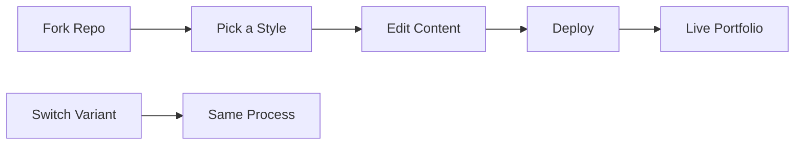

<div align="center">

# 🎭 Personal Portfolio Template

*Multiple modern portfolio designs – from minimalist to creative animations*

[](https://vercel.com/new/clone?repository-url=https://github.com/MrShadowRIFAT/4A8NTUB-Personal_Portfolio_Template)


**Choose your vibe. Customize. Deploy.**

</div>

---

## ✨ Why This Project

Multiple stunning portfolio styles in one repo. From minimal to bold animations, find the perfect design that matches your personality. Pick one and go live in minutes.

---

## 🔥 Features

🎨 **5+ Design Variants** – Creative, glitch, particle, video, water animations  
⚡ **Performance Optimized** – Fast loading, smooth animations  
📱 **Fully Responsive** – Mobile, tablet, desktop perfect  
🎬 **Rich Animations** – CSS & JS powered visual effects  
🎯 **Clean Code** – Simple HTML/CSS/JS, easy to customize  
🌐 **Production Ready** – Deploy immediately  
✏️ **Easy Edit** – Modify directly on GitHub  

---

## 🚀 Quick Setup

### 1️⃣ Fork Repository
```bash
# Click Fork button on GitHub
# Your own copy is ready
```

### 2️⃣ Deploy with Vercel
Press the button above → Connect GitHub → Deploy (instant!)

### 3️⃣ Local Development
```bash
git clone https://github.com/YOUR_USERNAME/4A8NTUB-Personal_Portfolio_Template.git
cd 4A8NTUB-Personal_Portfolio_Template
python -m http.server 8000
# Open http://localhost:8000
```

---

## 📁 Portfolio Styles

| File | Style | Best For |
|------|-------|----------|
| `index.html` | Minimal & Clean | Professionals |
| `creative.html` | Modern & Bold | Creative Fields |
| `creative-2.html` | Alternative Design | Design Portfolios |
| `creative-3.html` | Advanced Layout | Agencies |
| `creative-4.html` | Premium Style | Executives |
| `creative-5.html` | Trendy Design | Tech Companies |
| `glitch.html` | Glitch Effect | Developers, Designers |
| `particle.html` | Particle Animation | Modern Vibe |
| `video.html` | Video Background | Multimedia Focus |
| `water.html` | Water Animation | Creative Expression |
| `no-animation.html` | Static Version | Simplicity |

---

## 🧠 How It Works



---

## 🛠️ Tech Stack

<div align="center">


</div>

**HTML5** • **CSS3** • **JavaScript** • **Animations** • **Responsive Design**

---

## 📝 Customization

1. **Pick Your Style** – Choose from 10+ HTML variants
2. **Edit Content** – Update text with your info
3. **Replace Images** – Add photos to `img/` folder
4. **Customize Colors** – Modify CSS in `css/` folder
5. **Adjust Animations** – Edit JS for speed & effects

---

## 🎭 Style Comparison

| Feature | Creative | Glitch | Particle | Video | Water |
|---------|----------|--------|----------|-------|-------|
| Animation | ✅ | ✅ | ✅ | ✅ | ✅ |
| Minimalist | ⭐⭐ | ⭐ | ⭐⭐ | ⭐ | ⭐⭐ |
| Bold Impact | ⭐⭐⭐ | ⭐⭐⭐ | ⭐⭐⭐ | ⭐⭐⭐ | ⭐⭐ |
| Performance | ⭐⭐⭐ | ⭐⭐ | ⭐⭐ | ⭐⭐ | ⭐⭐⭐ |

---

## 📦 Deployment

| Platform | Time | Cost |
|----------|------|------|
| **Vercel** | < 1 min | Free |
| **GitHub Pages** | 2 mins | Free |
| **Netlify** | 2 mins | Free |
| **Custom Host** | 5 mins | Paid |

---

## 📊 GitHub Stats

<div align="center">


</div>

---

## 👨‍💼 Author

**MrShadowRIFAT** | [🔗 rifat.website](https://rifat.website) | [📧 noreply@rifat.website](mailto:noreply@rifat.website)

---

<div align="center">

**[⭐ Star This Repo](#)** • **[🐛 Report Issue](#)** • **[💡 Suggest Feature](#)**

Made with ❤️ for creative professionals

</div>